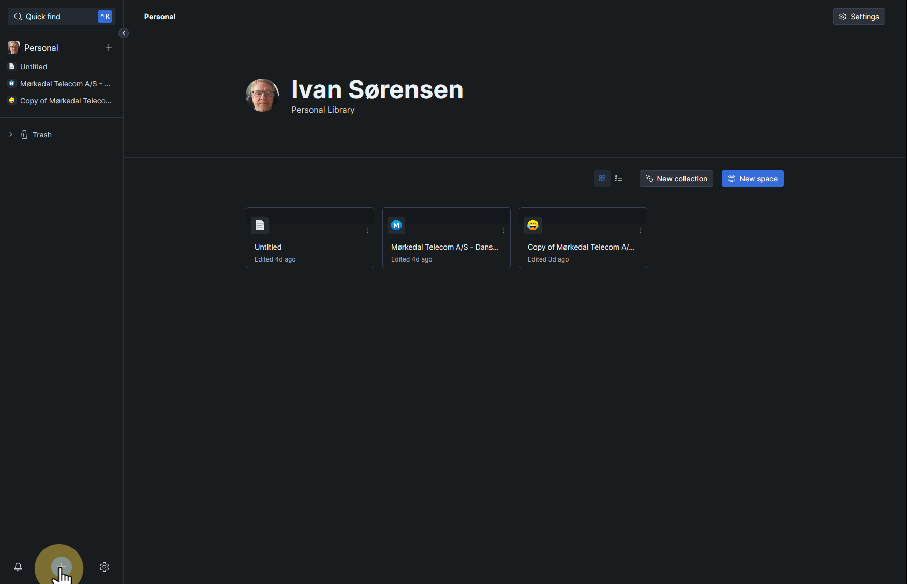
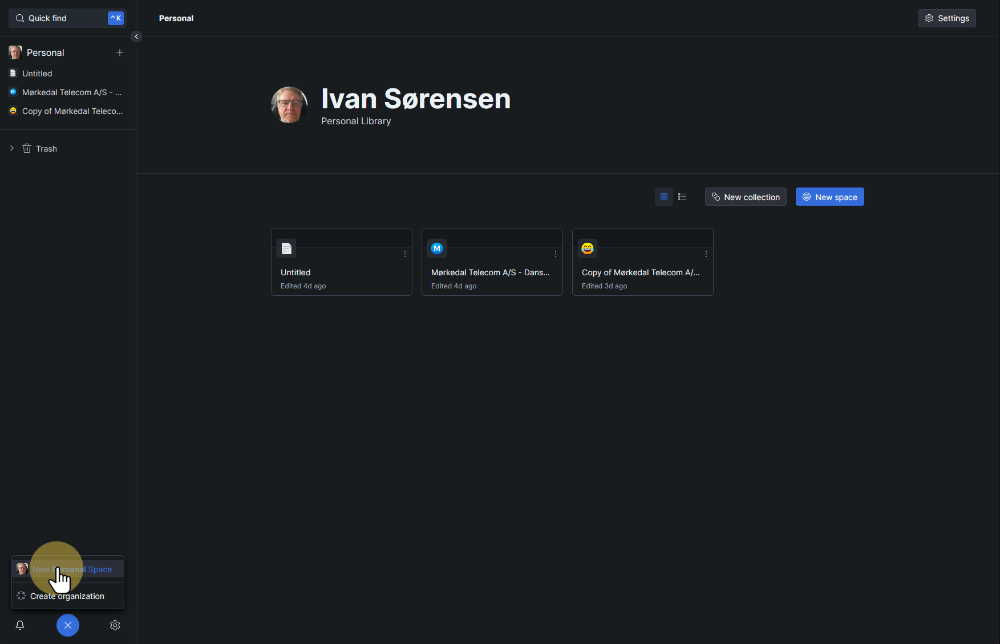
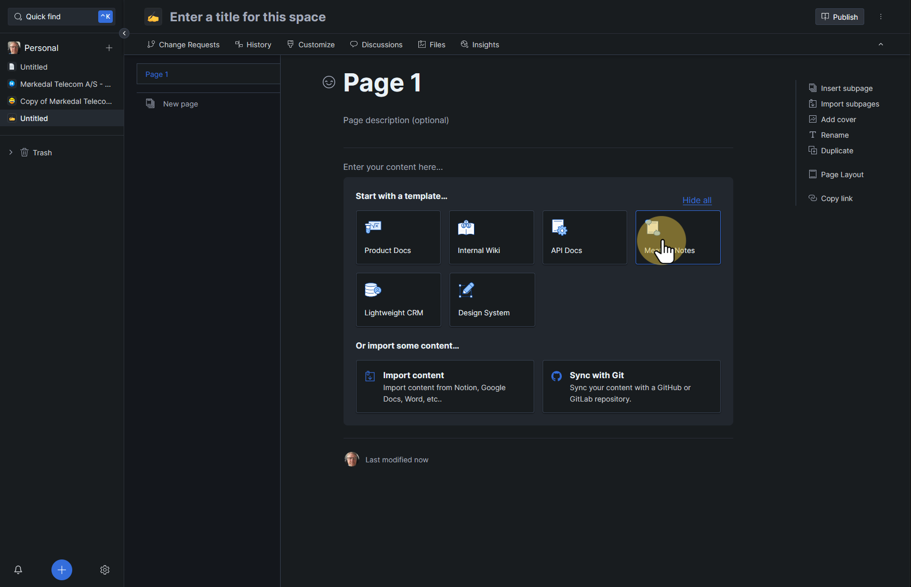

# GitBook test
This is made on Folge.me - and want to export as MarkDown to Gitbook

## Step 1
Just to show something

Press + 

## Step 2
Press "New PersonalSpace"

## Step 3
Just chosing something for this test

